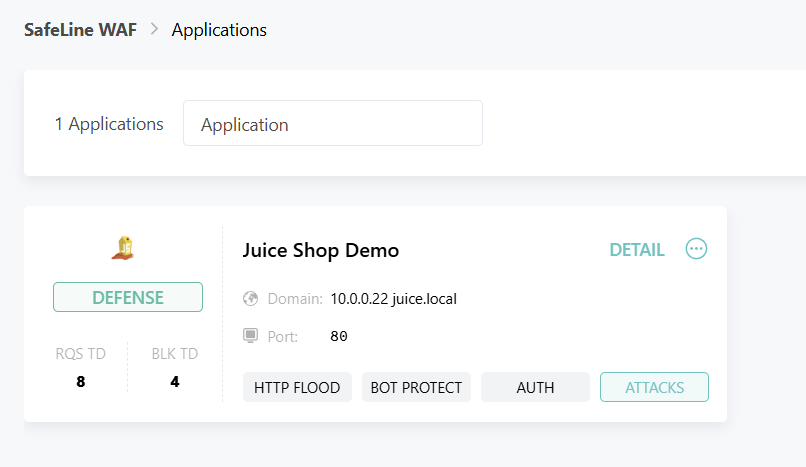
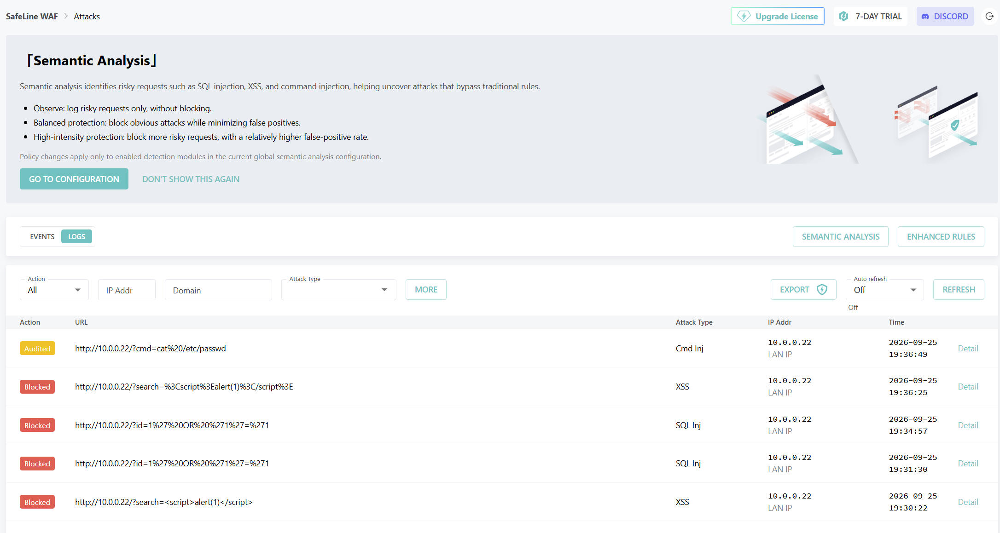

Enterprise Web Application Firewall (WAF) Deployment & Threat Mitigation Homelab

Executive Summary

This project demonstrates the deployment, configuration, and threat testing of SafeLine WAF—an enterprise-grade Web Application Firewall—protecting an intentionally vulnerable OWASP Juice Shop web application.

The primary objective of this homelab was to construct an inline reverse proxy defense architecture, execute real-world web application attack vectors (SQL Injection, Cross-Site Scripting, Path Traversal), and validate real-time threat detection, automated blocking, and security telemetry logging.

Architecture & Traffic Flow

                                 [ Network Perimeter ]
                                           │

[ Attacker / Client Browser ] ───────────┼───────────┐
│ │
▼ │
┌──────────────────────┐│
│ SafeLine WAF ││ (Inline Reverse Proxy)
│ (Port 80 / 9443) ││
└───────────┬──────────┘│
│ │
▼ │
┌──────────────────────┐│
│ OWASP Juice Shop ││ (Protected Backend Target)
│ (Port 3000) ││
└──────────────────────┘│
│
[ Internal Network ] ┘

Network Proxying: SafeLine sits in front of the application layer on port 80, inspecting incoming HTTP requests before reverse-proxying clean traffic upstream to Juice Shop (X.X.X.X.X:3000).

Session Tracking: SafeLine enforces cookie-based session identification via sl-session headers to monitor visitor behavior and rate limits.

Inline Enforcement: Configured in active Blocking Mode to terminate malicious TCP sessions at the gateway layer.

Key Technologies & Tools

Security Controls: SafeLine WAF (Docker-based deployment)

Vulnerable Application Target: OWASP Juice Shop

Operating System / Hypervisor: Ubuntu Linux VM

Testing Tools: curl, Web Browsers, URL Encoding utilities

Protocols & Concepts: HTTP/HTTPS, Reverse Proxies, OWASP Top 10, Header Inspection, Path Normalization

Deployment & Configuration Steps

1. Target Application Setup

Deployed the OWASP Juice Shop application container locally on port 3000:

docker run -d --name juiceshop -p 3000:3000 bkimminich/juice-shop

2. WAF Gateway Installation & Binding

Deployed SafeLine WAF management containers and initialized the admin console on port 9443.

Created a Web Service entry pointing to the local network IP:

Listening Port: 80

Domain / Binding: X.X.X.X

Upstream Address: http://X.X.X.X:3000

Attack Execution & Threat Mitigation Results

To test the resilience of the WAF rule engine, multiple OWASP Top 10 attack payloads were directed at the proxy interface (http://X.X.X.X/).

1. SQL Injection (SQLi) — OWASP A03:2021

Objective: Attempt parameter manipulation to extract data or bypass SQL syntax.

Payload:

curl -i "http://X.X.X.X/?id=1%27%20OR%20%271%27=%271"

Outcome: 403 Forbidden — SafeLine identified malicious SQL keywords (OR '1'='1') and terminated the request immediately.

2. Reflected Cross-Site Scripting (XSS) — OWASP A03:2021

Objective: Inject client-side executable script tags into HTTP parameters.

Payload:

curl -i "http://X.X.X.X/?search=%3Cscript%3Ealert(1)%3C/script%3E"

Outcome: 403 Forbidden — Intercepted by WAF signature detection before script reflection could occur.

3. Path Traversal / Directory Traversal — OWASP A01:2021

Objective: Attempt file system retrieval outside the web root (/etc/passwd).

Payload:

curl -i "http://X.X.X.X/../../../../etc/passwd"

Outcome: Audited / Blocked — Evaluated via path normalization and flagged as an abnormal path traversal attempt.

Evidence & Verification Artifacts

Artifact 1: Terminal Response Proving WAF Block (403 Forbidden)

Caption: Terminal output executing an XSS payload resulting in an HTTP 403 Forbidden status code returned by SafeLine WAF.

Artifact 2: SafeLine Threat Telemetry Dashboard

Caption: Real-time attack detection log entries showing blocked SQL Injection, XSS, and Path Traversal attempts.

Artifact 3: SafeLine Protected Site Configuration

Caption: Configuration view displaying the port binding (80) and upstream application target (X.X.X.X:3000).

### 1. Safeline Application

### 2. Safeline Event & Attack Logs

Key Technical Lessons & Insights

Inline vs. Passive Deployment: Learned the crucial difference between passive network monitoring (IDS) and inline reverse proxy blocking (WAF).

URL Path Normalization: Discovered how web servers and proxy engines normalize relative paths (../) before handing them over to backend routing engines or WAF engines.

Forensics & Incident Response: Gained practical experience reading security events, identifying source IP addresses, examining request headers, and confirming threat containment.

Author

Veronica Ramirez

Cybersecurity Professional & Security Engineer

Website: cybersecurity.veronica-ramirez.com
